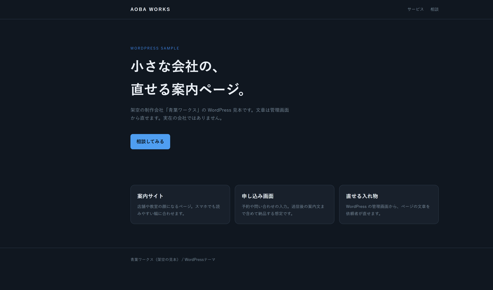

# 青葉ワークス（WordPress見本）

小さな会社の案内サイトを、相手が文章を直せる入れ物（WordPress）に載せた見本です。実在の会社ではありません。

できること：

- トップ・サービス案内の表示
- 相談フォーム（画面上の受付まで。メールは飛びません）
- 管理画面からページ文章を直す



## 動かし方（このパソコン）

Docker Desktop が入っている前提です。

1. このフォルダで、次を実行する  

```
docker compose up -d
```

2. 続きのセットアップ  

```
docker compose --profile setup run --rm wpcli core install --url="http://localhost:8080" --title="青葉ワークス" --admin_user="admin" --admin_password="aoba-local" --admin_email="aoba@example.com" --skip-email
```

3. ブラウザで開く  

http://localhost:8080

管理画面（自分のパソコン用）：  

http://localhost:8080/wp-admin  
ユーザー：`admin`  
パスワード：`aoba-local`（インターネット公開用ではありません）

止めるとき：

```
docker compose down
```

## いまできないこと

独自の会員ログイン、決済、ネットショップ、SEO一式の運用は、この見本の範囲外です。
